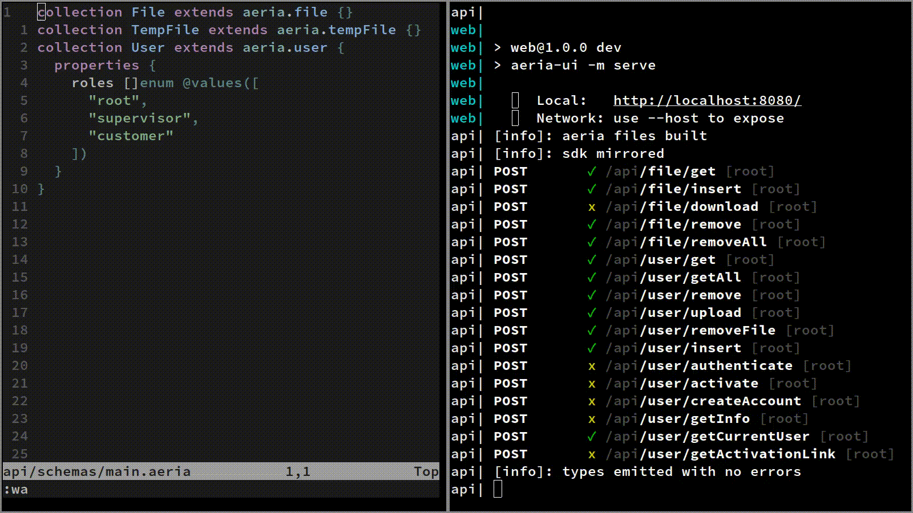

<small>Art made by [@Tortoddy100](https://x.com/Tortoddy100)</small>

 

[Documentation](https://aeria.land/docs/aeria/)

Aeria is a <10k lines of code **CRUD engine** with a strong emphasis on type safety and developer experience. It ships a thin **MongoDB** abstraction layer and a [Prisma-like DSL](https://github.com/aeria-org/aeria-lang) that serves model definition with support for nested objects, arrays, references, upload fields, and more. On top of that a HTTP routing API with very simple bindings is provided to build business logic.

The project was created to offer a more cohesive and type-safe alternative to projects with CRUD-heavy needs. It is also a modern alternative to Mongoose and Prisma.

### Quickstart

>$ npm create -y aeria-app hello-world

### Features

- Authentication
- File management
- Security (rate limiting, entity ownership, RBAC, etc)
- tRPC-like SDK with 1:1 typing
- Ready-to-use dashboard extensible with [Vue](https://github.com/vuejs/core)

### Community

Reach out to learn more about Aeria and know about upcoming features.

